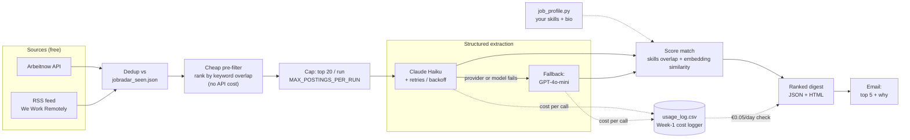

# JobRadar

A daily script that fetches AI-engineer job postings, extracts them into a
structured schema, scores each one against *your* profile, and sends you a
ranked digest — so you spend your time reading five good matches instead of
scrolling fifty listings.

Built as part of an 8-week self-taught AI Engineer roadmap: this is the
project where the earlier building blocks (structured outputs, retries and
fallback, embeddings, cost tracking) get wired into something used every
single day, not just a one-off exercise.

## What it does

1. Fetches new postings from the [Arbeitnow API](https://www.arbeitnow.com/api/job-board-api) (free, public) and any RSS/Atom job feed (defaults to [We Work Remotely](https://weworkremotely.com/categories/remote-programming-jobs.rss)).
2. Skips anything already shown in a previous run (`jobradar_seen.json`).
3. Ranks the remaining postings with a free, local keyword pre-filter, and only sends the most promising ones on to the paid extraction step.
4. Extracts each posting into a structured `JobPosting` (title, skills, salary, visa sponsorship, German requirement, ...) via an LLM call, with retries and a Claude → GPT-4o-mini fallback if a provider has a bad day.
5. Scores every posting against your own profile (`job_profile.py`) using two independent signals — exact skills overlap and embedding similarity — combined into one score.
6. Tags each posting as **Werkstudent / Praktikum** (student-eligible now) or **Full-time** (worth tracking for later), rather than silently filtering one out.
7. Writes a ranked JSON + HTML digest, and emails you the top 5 with a plain-language reason for each match.

## Architecture



Fetching is free, so it happens broadly (up to 40 candidates); extraction
costs real API tokens, so a free local keyword pre-filter ranks candidates
*before* the paid step and only the top `MAX_POSTINGS_PER_RUN` (default 20)
get extracted. Every extraction call is logged to `usage_log.csv` via the
Week-1 cost logger, and the run checks its own total against a €0.05/day
target after every run — not just a much looser €2 runaway-spend safety cap.

## Setup

Requires Python 3.12 and [uv](https://docs.astral.sh/uv/).

```bash
uv add anthropic openai instructor tenacity sentence-transformers feedparser beautifulsoup4 httpx python-dotenv
```

Create a `.env` file in the project root:

```bash
ANTHROPIC_API_KEY=sk-ant-...
OPENAI_API_KEY=sk-proj-...

# Optional -- only needed for email delivery. Skipping these still writes
# the JSON/HTML digest, it just won't email you.
EMAIL_FROM=you@gmail.com
EMAIL_APP_PASSWORD=xxxxxxxxxxxxxxxx
EMAIL_TO=you@gmail.com
```

`EMAIL_APP_PASSWORD` is a Gmail **app password**, not your normal login —
generate one at Google Account → Security → 2-Step Verification → App
passwords (needs 2FA enabled first). Copy it as one block; if you paste it
with the spacing Google displays it with, JobRadar strips the whitespace
automatically either way.

Edit `job_profile.py` with your actual skills and a few honest sentences
about what you're looking for — the whole scoring pipeline is only as good
as this file.

Run it:

```bash
uv run python jobradar.py
```

Run it again later and it'll only process postings you haven't seen yet.

## Sample output


Each card shows the match score with a breakdown (skills overlap vs.
semantic similarity), an employment-type badge, and the extracted skills,
salary, visa, and language-requirement pills. The header shows whether the
run stayed under the €0.05/day cost target.

## Design notes

A few things worth calling out from a production standpoint, since this
started as a learning exercise but ended up needing real engineering:

- **Two independent scoring signals, not one.** Exact skills overlap is
  precise but brittle to synonyms ("GenAI" vs "LLM"); embedding similarity
  catches the semantic match but can be fooled by superficially similar
  wording. Combining both is more robust than trusting either alone.
- **Cross-provider fallback, not same-provider.** If Anthropic has a
  provider-wide outage, every model in an Anthropic-only chain fails
  together — falling back to OpenAI survives outages a same-provider chain
  can't.
- **Word-boundary matching, not substring matching**, for both the
  employment-type tagging and the pre-filter — a naive `"intern" in text`
  check also matches "**intern**ational" and "**intern**et", which
  genuinely mislabeled real postings during development.
- **Graceful degradation over hard failure.** If the job-board API's rate
  limit gets hit even after retries, the run returns whatever it already
  fetched instead of crashing with zero output.
- **A count-based cap, not just a euro-based one**, on how many postings
  get paid extraction per run — a euro cap alone can be 40x looser than the
  actual per-posting cost pattern justifies.

## Known limitations

- No LinkedIn feed by default. LinkedIn doesn't offer an official
  job-search RSS feed, and third-party scrapers that fake one violate
  LinkedIn's User Agreement (see *hiQ Labs v. LinkedIn*). `fetch_rss_postings()`
  works against any RSS/Atom URL if you decide to add one anyway.
- The €0.05/day target assumes Claude Haiku pricing and ~20 postings/run;
  longer job descriptions or a run that falls back to GPT-4o-mini more
  often can shift the actual cost, though rarely by much.
- Checkboxes and "seen" state are local (`jobradar_seen.json`) — there's no
  multi-device sync.


