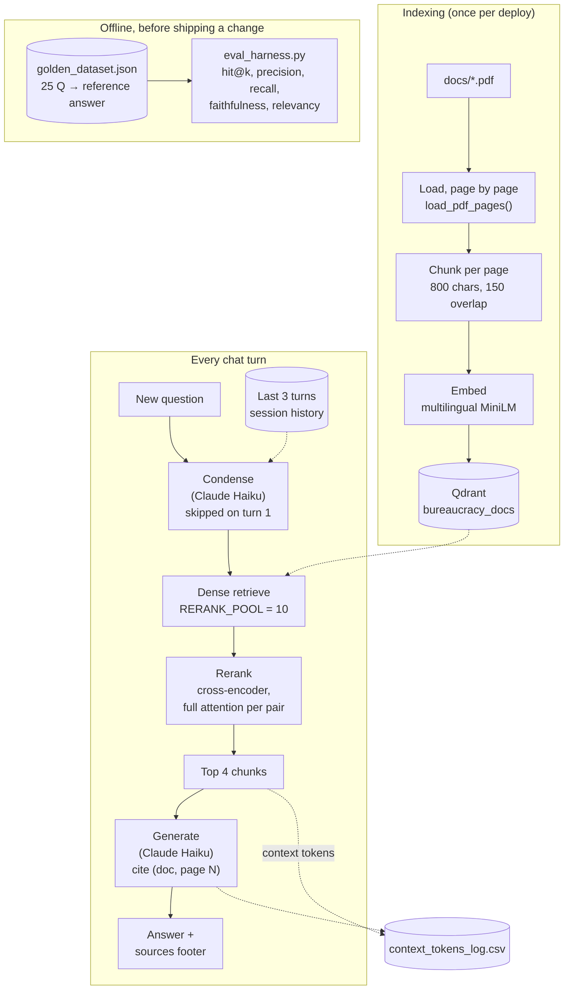

# Beamter-Bot 🏛️

A RAG chatbot for German bureaucracy: Anmeldung (address registration), the
Blue Card EU (work visa), and the Rundfunkbeitrag (broadcasting fee) — the
three things every international student in Germany ends up googling in
their first month. Every answer cites the exact document and page it came
from, so "trust me" is never the only option, and it holds a real
conversation — follow-ups don't need to repeat the topic, and it'll switch
languages on request without losing the thread.

**[Try the live demo →](https://beamter-bot-dzscetnffc6qfvkj3u5obn.streamlit.app/)**
(free-tier hosting — the first message after a while may take a few extra
seconds while it wakes up)

## What it does

1. Loads a folder of German government PDFs, page by page, and chunks each
   page into overlapping windows.
2. Embeds every chunk with a multilingual model and stores it in Qdrant,
   tagged with its source document and real page number.
3. On each question, folds the last few turns of conversation into one
   standalone question — so "kannst du das auf Englisch erklären?" ("can you
   explain that in English?") resolves against whatever "that" actually
   means, instead of being searched on its own.
4. Retrieves a wide pool of candidate chunks, then re-scores that pool with
   a cross-encoder — slower per-candidate than plain vector search, but far
   more accurate at picking the single best chunk out of a handful of
   plausible ones.
5. Sends only the survivors to Claude, instructed to answer strictly from
   that context and cite `(document, page N)` for every claim, in whichever
   language the question is actually asking in.
6. Logs how many tokens each answer's retrieved context actually cost, to
   `context_tokens_log.csv` — retrieval is a token firehose by construction,
   and that cost was never measured before it started being logged.

## Architecture



- **Multilingual embeddings** (`paraphrase-multilingual-MiniLM-L12-v2`) so
  German source documents and English questions land in the same vector
  space — a plain English-only model doesn't guarantee that alignment.
- **Reranking** exists because dense retrieval embeds the question and each
  chunk independently and can miss a chunk that's relevant in a way plain
  similarity doesn't capture. A cross-encoder sees the question and a
  candidate together, with full attention over the pair — too slow to run
  over an entire collection, which is why it only reranks a small pool
  instead of replacing dense search outright. See **Evaluation** below for
  the measured effect, not just the theory.
- **Condensing** is what makes multi-turn conversation actually work: the
  first message in a session skips it entirely (nothing to fold in yet),
  but every follow-up gets rewritten into a standalone question before
  retrieval runs — which also carries language-switch requests forward, so
  one rewrite step fixes both retrieval relevance and response language.

## Evaluation

Run via `eval_harness.py` against `golden_dataset.json` (25 hand-verified
question → reference-answer pairs, each grounded in the real German text in
`docs/`), comparing dense retrieval alone against dense retrieval +
cross-encoder reranking:

```
                     dense           dense+rerank    delta
hit@1                __/25 (__%)     __/25 (__%)     ___
ctx precision@1      ____            ____            ____
hit@2                __/25 (__%)     __/25 (__%)     ___
ctx precision@2      ____            ____            ____
hit@4                __/25 (__%)     __/25 (__%)     ___
ctx precision@4      ____            ____            ____
ctx recall@4         ___%            ___%             ___%

faithfulness (dense+rerank):      ____
answer relevancy (dense+rerank):  ____
```

*hit@k* = the correct document+page was among the top *k* retrieved chunks.
*Faithfulness* and *answer relevancy* are Claude-judged, hand-rolled
analogues of the RAGAS metrics of the same name. hit@1 is the metric most
likely to move from reranking — it's exactly the case reranking targets,
promoting the single best chunk to the top of a small pool where dense
similarity alone ranked it 2nd or 3rd. On a corpus this size (a handful of
PDFs, a few dozen chunks), any single metric can swing by ±1 question on a
coin-flip-close score — the direction of the delta across several metrics
together is more informative than any one number moving.

## Demo


## Setup

Requires Python 3.12, [uv](https://docs.astral.sh/uv/), and a local Qdrant
instance:

```bash
docker run -p 6333:6333 qdrant/qdrant
uv add pypdf sentence-transformers anthropic qdrant-client numpy streamlit
```

Create a `.env` file with `ANTHROPIC_API_KEY=sk-ant-...`, then:

```bash
uv run python rag_chat.py docs/       # terminal chat loop
uv run streamlit run streamlit_deploy/streamlit_app.py   # local web UI
```

## Deploy

Live on [Streamlit Community Cloud](https://streamlit.io/cloud), deployed
straight from `streamlit_deploy/` in this repo — no separate git remote, no
Docker on the host, embedded Qdrant instead of a server. Full steps and the
free-tier tradeoffs (cold starts, non-persistent disk, single instance) are
in `streamlit_deploy/DEPLOY.md`. A Gradio build for Hugging Face Spaces
also exists in `space_deploy/`, kept but not currently free to host — see
that folder's `DEPLOY.md` for why.

## Design notes

- **Reranking is measured, not assumed.** The eval table above exists
  because a cross-encoder can also make things *worse* on a small corpus if
  it's confidently wrong on a handful of questions — "should help in
  theory" isn't the same claim as "measured to help here."
- **Every query's context cost is logged**, not estimated after the fact —
  `count_context_tokens()` calls Anthropic's free token-counting endpoint on
  the exact context string generation is about to see, with a `chars / 4`
  fallback (and a flag noting which kind of number it got) if that call
  ever fails.
- **The response logic has no UI framework calls in it.** `respond()` in
  `streamlit_app.py` (and its Gradio equivalent in `space_deploy/app.py`)
  is a plain, directly-testable function; `rag_chat.py`'s real pipeline
  functions are imported unchanged into both UIs rather than reimplemented
  per framework.
- **`golden_dataset.json` stays single-turn on purpose.** Every golden
  question is graded as if asked cold, with no prior conversation —
  measuring multi-turn quality well needs multi-turn golden conversations,
  a bigger, separate dataset-design problem rather than something to bolt
  onto a single-turn harness.

## Known limitations

- Free-tier hosting sleeps after inactivity, and the disk isn't guaranteed
  persistent across restarts — `context_tokens_log.csv` is session-scoped
  on the live demo, not a durable record.
- One shared app instance — fine for sharing a link, not built for
  concurrent production traffic.
- Retrieval sends the full `CHUNK_SIZE` (800 chars) of every surviving
  chunk to the LLM even when only a sentence of it is relevant; dedup and
  compression ideas to cut that cost are noted in `BEAMTER_BOT.md` but not
  yet built.
- `golden_dataset.json` is 25 questions over 3 documents — real signal at
  this project's scale, but small enough that single-metric swings of ±1
  question shouldn't be over-read (see **Evaluation** above).

---

For the task-by-task build log — why each decision got made, what broke,
what got tried and discarded — see [`BEAMTER_BOT.md`](BEAMTER_BOT.md).
